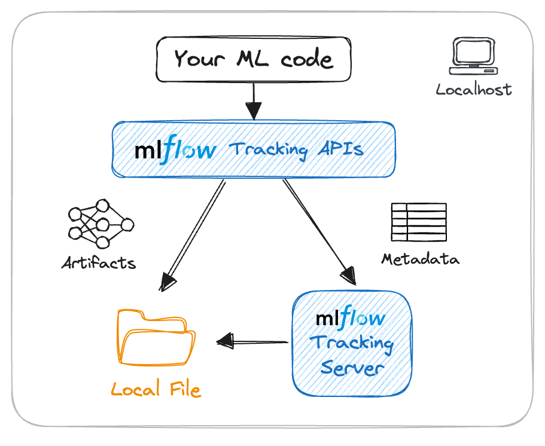

# Week 2 - Experiment Tracking

**Table of contents**

1. [Introduction to MLOps](#part-1)
2. [Configure enviromnent](#part-2)
3. [Train the first ML model](#part-3)
4. [MLOps Maturity model](#part-4)

## Part 1: Introduction <a id='part-1'></a>

+ Important concepts to know:
  + **ML Experiment**: the process of building ML models.
  + **Experiment run**: each trial in an ML experiment.
  + **Run artifact**: any file that is associated with an ML run.
  + **Experiment metadata**.

+ What is Experiment Tracking?
  + Experiment tracking is the process of keeping track of all the **relevant information** from an **ML experiment**, includes:
    + Source code;
    + Environment;
    + Data;
    + Model;
    + Hyperparameters;
    + Metrics.
  
+ Why is Experimentr Tracking important?
  + Reproducibility.
  + Organization.
  + Optimization.

+ Why should not tracking in Spreadsheet, Excel??
  + Error prone.
  + No standard format.
  + Visibility and Collaboration.

+ MLOps lifecycle and ML experiment tracking:


+ **MLflow**:
  + A Python open-source library for the Machine Learning lifecycle. Including:
    + Tracking.
    + Models.
    + Model Registry.
    + Projects.
  
  + MLflow allows to organize experiment into runs, and keep track of: 
    + Parameters.
    + Metrics.
    + Metadata.
    + Artifacts.
    + Models.
  
  + MLflow also automatically logs extra information for the run:
    + Source code.
    + Version of the code (git commit).
    + Start and end time.
    + Author.
  
## Part 2: Getting started with MLflow

### 2.1. First experiment

+ Installation:

  ```bash
  pip install mlflow
  ```

+ Launch the MLflow UI:

  ```bash
  mlfow ui
  ```

  + Go to URL: http://127.0.0.1:5000/

+ Start the MLflow server with SQLite as backend:

  ```bash
  mlflow ui --backend-store-uri sqlite:///mlflow.db
  ```

+ Import MLflow in Python:

  ```python
  import mlflow
  
  mlflow.set_tracking_uri("sqlite:///mlflow.db")
  mlflow.set_experiment("nyc-taxi-experiment")
  ```

+ To wrap each model training in a MLflow run and log experiment information:

  ```python
  with mlflow.start_run():
    mlflow.set_tag("developer", "nda")
    mlflow.log_param("train_data_path", "https://d37ci6vzurychx.cloudfront.net/trip-data/yellow_tripdata_2024-01.parquet")
    mlflow.log_param("val_data_path", "https://d37ci6vzurychx.cloudfront.net/trip-data/yellow_tripdata_2024-02.parquet")

    mlflow.log_param("mode", "linear_reg")
    model = LinearRegression()
    model = model.fit(X_train, y_train)
    
    y_pred = model.predict(X_val)

    mse = mean_squared_error(y_val, y_pred)
    rmse = root_mean_squared_error(y_val, y_pred)
    mlflow.log_metric("mse", mse)
    mlflow.log_metric("rmse", rmse)
    print("mse: ", mse)
    print("rmse: ", rmse)
  ```

+ Go to MLflow UI to view the experiment with logged information.


### 2.2. Experiment tracking

+ Optimize hyperparameters using ```hyperopt``` library.

  ```python
  import xgboost as xgb

  from hyperopt import fmin, tpe, hp, STATUS_OK, Trials
  from hyperopt.pyll import scope
  ```

+ Create train and validation matrix of XGBoost: 

  ```python
  train = xgb.DMatrix(X_train, label=y_train)
  val = xgb.DMatrix(X_val, label=y_val)
  ```

+ Create an objective function for each training iteration: 

  ```python
  def objective(params):

    with mlflow.start_run():
        mlflow.set_tag('model', 'xgboost')
        mlflow.log_params(params)
        booster = xgb.train(
            params=params,
            dtrain=train,
            num_boost_round=1000,
            evals=[(val, "validation")],
            early_stopping_rounds=50
        )
        y_pred = booster.predict(val)
        rmse = root_mean_squared_error(y_val, y_pred)
        mlflow.log_metric("rmse", rmse)
    
    return { "loss": rmse, 'status': STATUS_OK }
  ```

+ Define the searching space for each hyperparamter:

  ```python
  search_space = {
    'max_depth': scope.int(hp.quniform('max_depth', 4, 100, 1)),
    'learning_rate': hp.loguniform('learning_rate', -3, 0), # [exp(-3), exp(0)] - [0.05, 1]
    'reg_alpha': hp.loguniform('reg_alpha', -5, -1),
    'reg_lambda': hp.loguniform('reg_lambda', -6, -1),
    'min_child_weight': hp.loguniform('min_child_weight', -1, 3),
    'objective': 'reg:linear',
    'seed': 42,
  }
  ```

+ Start the training and optimization: 

  ```python
  best_result = fmin(
    fn=objective,
    space=search_space,
    algo=tpe.suggest,
    max_evals=50,
    trials=Trials()
  )
  ```

+ While the experiment is running, we can go to the MLflow UI to view and compare experiment runs: 

  

  + Compare by Coordiate plot: 
  

  + Scatter plot: 
  

  + Contour plot: 
  

+ Choose the best model from experiments and copy its best hyperparameters to train the final model:

  ```python
  best_params = {
    'learning_rate': 0.9997943283037245,
    'max_depth': 33,
    'min_child_weight': 7.54030397204494,
    'objective': 'reg:linear',
    'reg_alpha': 0.01184897746903326,
    'reg_lambda': 0.011426820732636738,
    'seed': 42
  }

  mlflow.xgboost.autolog()

  booster = xgb.train(
      params=best_params,
      dtrain=train,
      num_boost_round=500,
      evals=[(val, "validation")],
      early_stopping_rounds=50
  )

  y_pred = booster.predict(val)
  rmse = root_mean_squared_error(y_val, y_pred)
  print(rmse)
  ```

  + Using ```mlflow.xgboost.autolog()``` to enable auto logging for XGBoost training.

+ Check the **Artifacts** of the trained model on MLflow UI: 
  


### 2.3. Model management

+ What's wrong with traditional model saving methods?
  + Error prone.
  + No model versioning.
  + No model lineage.

+ Save model's Aritifact in MLflow:
  + Method 1: 

    ```python
    with mlflow.start_run():
      mlflow.set_tag('model', 'xgboost')
      mlflow.log_params(params)
      
      ....

      mlflow.log_metric("rmse", rmse)
      
      mlfow.log_artifact(local_path="models/lin_reg.bin", artifact_path="models_pickle/")
    ```

  + Method 2 (preferred): 

    ```python
    ### ....

    mlflow.xgboost.log_model(booster, artifact_path="models_mlflow")

    ```

+ Save the trained preprocessor as Artifact:

  ```python
  ...
  with open("models/preprocessor.b", "wb") as f_out:
    pickle.dump(dv, f_out)

  mlflow.log_artifact("models/preprocessor.b", artifact_path="preprocessor")
  # ...
  ```

+ Load and use the model for prediction (with the code sample from MLflow:

  ```python
  import mlflow
  logged_model = 'runs:/92025337761b47258bb509b166789a29/models_mlflow'

  # Load model as a PyFuncModel.
  loaded_model = mlflow.pyfunc.load_model(logged_model)

  # Predict on a Pandas DataFrame.
  import pandas as pd
  loaded_model.predict(pd.DataFrame(data))
  ```

+ Load the model as an XGBoost model, instead of Pyfunc: 

  ```python
  logged_model = 'runs:/92025337761b47258bb509b166789a29/models_mlflow'

  xgboost_model = mlflow.xgboost.load_model(logged_model)
  ```

+ Predict the data:

  ```python
  y_pred = xgboost_model.predict(val)
  ```

+ MLflow model format: 
  

### 2.4. Model Registry

+ **Model Registry **component is a centralized model store, set of APIs and UI, to collaboratively manage the full lifecycle of an MLflow model. It provides: 
  + Model lineage.
  + model versioning.
  + Model stage transitions and model aliases.
  + Annotations (tag, description...).

  

+ In the Artifact tab, pick the best trained model, click **Register Model**.
  + Create a new model name if we do not have one.
  

+ Go to the **Model** tab to check the registerd models.
  

+ Enter to one model detail and check the versions of the model.
  

  + We can add Description, Tags, Schema for each model version.

+ Add the **Model Aliases** for the versioned model. For example, mark the alias ```staging``` for the model.
  

+ Instead of using MLflow UI for Model Registry. We can perform the actions in Python by using the **MLflow Client** library
  + Refer to this notebook: [register_model.py](register_model.py)

### 2.5. MLflow in practice

+ Configuring MLflow:
  + **Backend store:**
    + local filesystem.
    + SQLAlchemy compatible DB (e.g. SQLite).
  
  + **Artifacts store:**
    + local filesystem.
    + remote (e.g. s3 bucket).

  + **Tracking server:**
    + no tracking server.
    + localhost.
    + remote.


+ Reference: https://mlflow.org/docs/latest/tracking.html

#### Scenario 1: A single data scientist participating in an ML competition

+ Reference: [mlflow_scenerio_1](mlflow_scenerio_1.ipynb)

  

#### Scenario 2: A cross-functional team with one data scientist working on an ML model

+ Reference: [mlflow_scenerio_2](mlflow_scenerio_2.ipynb)
  

#### Scenario 3: Multiple data scientist working on multiple ML models

+ Reference: [mlflow_scenerio_3](mlflow_scenerio_3.ipynb)
  